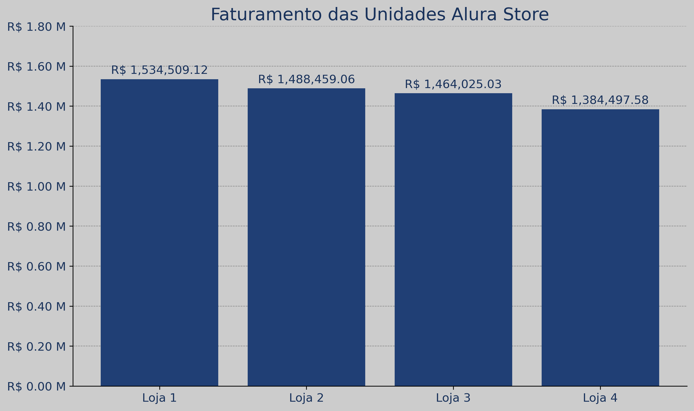

# <h1 align="center"> Relatório Final: Alura Store</h1>

## Introdução

### Objetivos da Análise de Dados
* O objetivo principal é gerar um relatório de recomendação detalhado para justificar qual loja deveria ser vendida, com base em métricas de desempenho como receita, categorias de produtos, avaliações de clientes, produtos mais/menos vendidos e custos médios de frete.

## Análise dos Indicadores

### Faturamento Total

As quatro lojas apresentam desempenho relativamente equilibrado, mas a Loja 4 possui o menor faturamento bruto:

**Loja 1:** R$ 1.534.509,12 
**Loja 2:** R$ 1.488.459,06 
**Loja 3:** R$ 1.464.025,03 
**Loja 4:** R$ 1.384.497,58

A Loja 1 lidera no faturamento mensal, enquanto as unidades 2 e 3 tem faturamento mensal semelhante. A Loja 4 neste ponto é destaque negativo ficando atrás da Loja 1 em aproximadamente R$ 150.000,00.

### Vendas Por Categoria

Nas 4 unidades temos unânimidade das categorias mais vendidas. Móveis, eletrônicos e brinquedos estão no pódio, seguidos de eletrodomésticos nas lojas 1, 2 e 3. Na Loja 4 a categoria eletrodomésticos está no 5º lugar em vendas atrás da categoria esporte e lazer.

Quando agrupamos os dados das 4 unidades **Alura Store**, as 8 categorias confirmam que o maior volume de vendas estão em móveis, eletrônicos e brinquedos.

### Média de Avaliações

**Loja 1:** 3,98 
**Loja 2:** 4,04 
**Loja 3:** 4,05 
**Loja 4:** 4,00

As avaliações médias dos clientes são muito próximas nas lojas 2 e 3, atingindo um bom grau de satisfação. A **Loja 1** é destaque negativo, tendo uma avaliação média de 3,98 e sendo a pior loja neste quesito.

### Produtos Mais e Menos Vendidos 

Vemos uma diversidade de produtos entre os 5 mais vendidos em cada loja configurando no hall das categorias mais vendidas. Porém chama atenção os ítems mais vendidos na **Loja 2**. O livro `Iniciando em programação` é o lider de vendas, o que destoa quando observamos sua categoria, que também ocorre com os outros produtos que estão na categoria `Instrumentos musicais`. 

### Frete Médio por Loja

**Loja 1:** R$ 34,69 
**Loja 2:** R$ 33,62 
**Loja 3:** R$ 33,07 
**Loja 4:** R$ 31,28

A **Loja 4** se destaca **positivamente** neste quesito possuindo a média de fretes mais baixa dentre as 4 unidades. Por outro lao a **Loja 1** é um destaque **negativo** possuindo a maior cobrança de frete dentre as lojas. 
Ainda assim a **Loja 4** não se destaca em vendas e/ou **faturamento** o que ocorre de forma oposta com a **Loja 1** que é líder de faturamento.

## Conclusão

Ao compilar as análises de faturamento, vendas por categoria, avaliações de clientes, produtos mais/menos vendidos e frete médio, podemos traçar um perfil para cada loja e formular uma recomendação para o Senhor João.

- **Loja 1**: Possui o maior faturamento, mas também o frete médio mais alto e a menor média de avaliação. Seus produtos mais vendidos são variados, incluindo móveis, eletrônicos e brinquedos. No entanto, os pontos negativos em custo e satisfação do cliente são notáveis.

- **Loja 2**: Apresenta um faturamento sólido e uma das maiores médias de avaliação. É a única loja onde um livro didático ("Iniciando em programação") é um dos produtos mais vendidos, o que pode indicar um nicho de mercado interessante ou uma clientela mais específica. O frete médio é intermediário.

- **Loja 3**: Destaca-se por ter a maior média de avaliação, indicando alta satisfação do cliente. O faturamento é bom, similar à Loja 2, e tem um frete médio competitivo (o segundo mais baixo). A Loja 3 também lidera em vendas de Móveis e tem um bom desempenho em Eletrônicos e Brinquedos. Embora tenha produtos como “Blocos de montar” e “Jogo de copos” entre os menos vendidos, o panorama geral é muito positivo.

- **Loja 4**: Apresenta o menor faturamento entre as quatro unidades, mas compensa com o frete médio mais baixo. Suas categorias de vendas são consistentes com as outras lojas nos produtos mais populares (Móveis, Eletrônicos, Brinquedos), mas o volume total é um pouco menor. A média de avaliação é boa, mas não a melhor.

Considerando todos os fatores, a **Loja 3** surge como a opção mais equilibrada e promissora para o Senhor João. Apesar de não ter o maior faturamento bruto, sua **liderança na satisfação do cliente (maior média de avaliação)** é um diferencial crucial para a sustentabilidade e crescimento a longo prazo de qualquer negócio. Além disso, seu faturamento é competitivo e o frete médio é o segundo mais baixo, indicando uma boa eficiência operacional.

A alta avaliação dos clientes na **Loja 3** sugere que ela oferece uma experiência de compra superior, o que pode se traduzir em maior fidelidade do cliente e recomendações boca a boca, fatores que são mais difíceis de quantificar financeiramente, mas extremamente valiosos. Investir na **Loja 3** permitiria alavancar essa base de clientes satisfeitos e talvez explorar oportunidades para otimizar as categorias de produtos de menor desempenho.

---

### Recomendação para Descontinuar uma Loja:

Como o Senhor João necessita desativar uma das lojas para investir em um novo empreendimento, a recomendação é encerrar as atividades da **Loja 4**.

**Justificativa Detalhada para a Escolha da Loja 4:**

1.  **Menor Faturamento Total:** A Loja 4 apresenta o menor faturamento entre todas as unidades. Embora a diferença não seja gigantesca, em um cenário de otimização de recursos para um novo investimento, é estratégico desmobilizar a unidade que gera menor receita para a empresa. Isso minimiza o impacto financeiro geral sobre o negócio existente ao liberar capital.
2.  **Média de Avaliação Apenas Mediana:** Embora não seja a pior em termos de avaliação (4.00), a Loja 4 não se destaca positivamente nesse aspecto como a Loja 3. Isso sugere que a experiência do cliente, embora satisfatória, não é um grande diferencial que justifique sua manutenção acima de outras unidades.
Sua **correlação em relação ao faturamento mensal é de -1,96%** o que confirma que ela não se destaca positivamente.
3.  **Falta de Destaques em Produtos Mais Vendidos:** Analisando os produtos mais vendidos, a Loja 4 não possui nenhum item de grande destaque que seja exclusivo ou que mostre um nicho de mercado forte o suficiente para justificar sua continuidade em um cenário de corte. Enquanto outras lojas têm produtos líderes mais marcantes ou nichos específicos (como o livro na Loja 2), a Loja 4 se mantém em um patamar mais genérico.
4.  **Eficiência de Frete Insuficiente para Compensar:** O frete médio mais baixo da Loja 4 (R$ 31,28) é um ponto positivo, indicando uma possível vantagem logística ou menor custo de envio. Contudo, essa eficiência não foi suficiente para impulsionar o faturamento a patamares competitivos com as outras lojas. Sua **corelação com o faturamento é de 99,7%**, igual ao das outras lojas. Isso sugere que a vantagem logística não é um motor de crescimento forte o bastante para compensar o menor volume de vendas.
5.  **Otimização de Recursos:** Encerrar a Loja 4 permitiria ao Senhor João realocar recursos (humanos, financeiros e de estoque) para as outras três lojas mais bem-sucedidas (especialmente a Loja 3, que é a mais promissora) e, crucialmente, direcionar o capital e o foco para o novo empreendimento. Descontinuar a unidade de menor desempenho é uma decisão lógica para maximizar o retorno sobre o investimento e garantir o sucesso do novo projeto sem comprometer as operações mais fortes da Alura Store.

